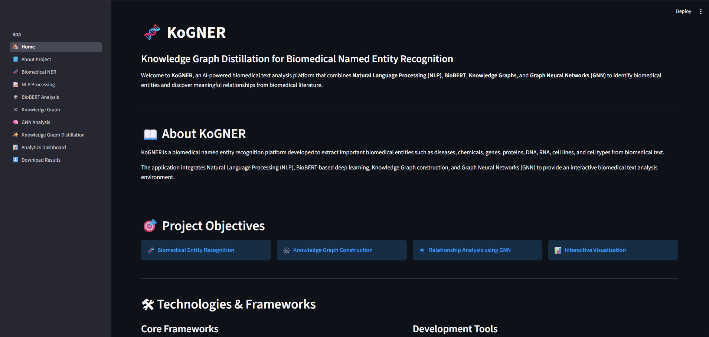
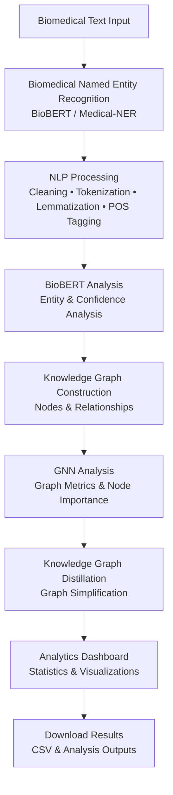
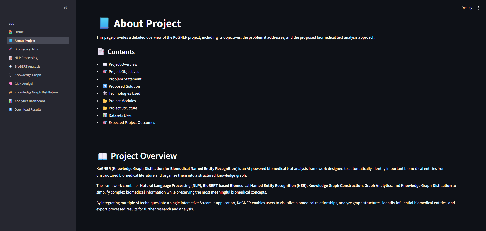
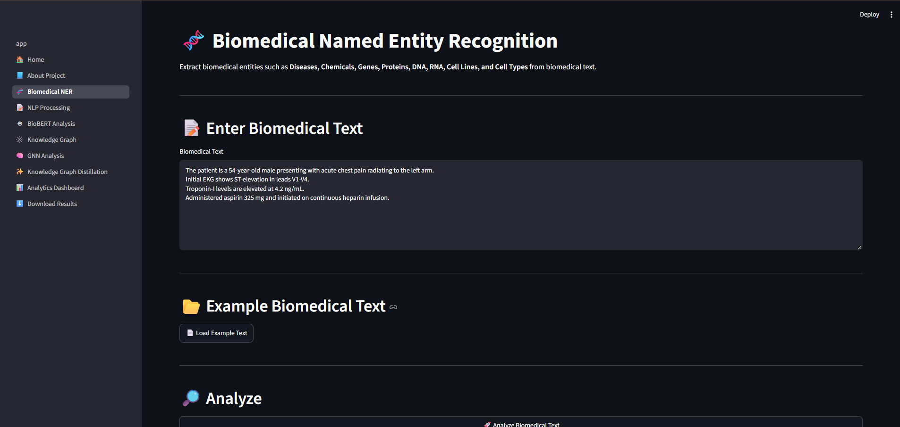
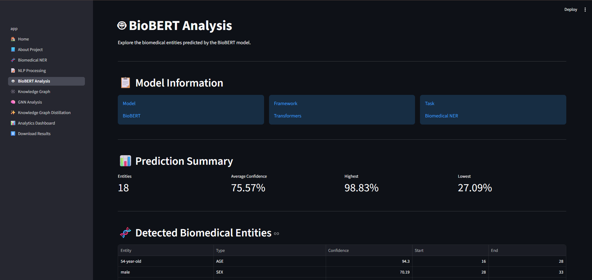
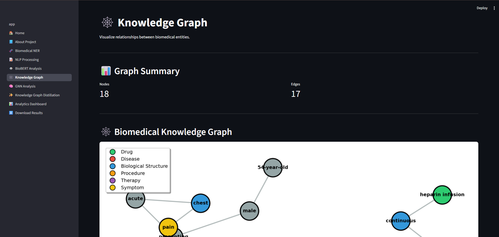
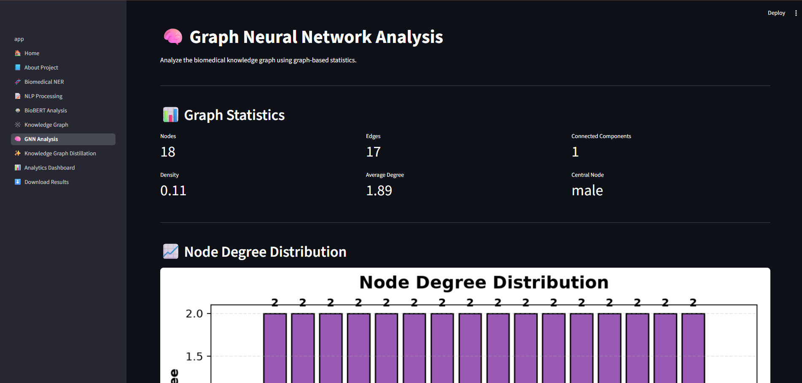
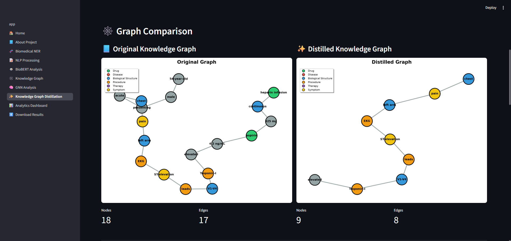
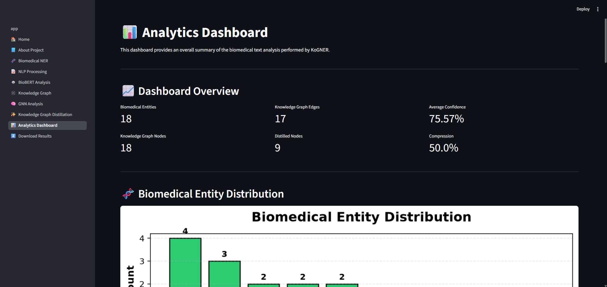

# 🧬 KoGNER

## A Novel Framework for Knowledge Graph Distillation on Biomedical Named Entity Recognition

An AI-powered biomedical text analysis platform that integrates Natural Language Processing (NLP), BioBERT, Biomedical Named Entity Recognition (NER), Knowledge Graphs, Graph Neural Networks (GNNs), and Knowledge Graph Distillation into a unified Streamlit application.

---

## 📸 Application Preview



---

# 📖 Project Overview

KoGNER is an AI-powered biomedical text analysis platform developed as a final-year Computer Science (Data Science) project. The system combines Natural Language Processing (NLP), BioBERT, Biomedical Named Entity Recognition (NER), Knowledge Graph Construction, Graph Neural Networks (GNNs), and Knowledge Graph Distillation into a single interactive application.

The platform processes biomedical text to identify important medical entities such as diseases, drugs, symptoms, procedures, therapies, and biological structures. These entities are transformed into a knowledge graph that captures semantic relationships between them. A Graph Neural Network is then applied to analyze the graph structure, followed by a Knowledge Graph Distillation module that reduces graph complexity while preserving essential information.

KoGNER provides an intuitive Streamlit-based interface with interactive visualizations, analytics dashboards, and downloadable outputs, making biomedical text analysis more accessible for research and educational purposes.

---

# 🎯 Project Objectives

- Develop an end-to-end biomedical text analysis platform.
- Perform biomedical named entity recognition using BioBERT.
- Apply NLP preprocessing and linguistic analysis.
- Construct semantic knowledge graphs from extracted entities.
- Analyze graph structures using Graph Neural Networks (GNNs).
- Distill knowledge graphs while preserving important relationships.
- Visualize analytical insights through interactive dashboards.
- Provide downloadable outputs for further analysis.

---

# ✨ Features

- 🧬 Biomedical Named Entity Recognition (NER)
- 📝 Natural Language Processing (NLP) Pipeline
- 🤖 BioBERT-based Biomedical Entity Analysis
- 🕸️ Interactive Knowledge Graph Construction
- 🧠 Graph Neural Network (GNN) Analysis
- ✨ Knowledge Graph Distillation
- 📊 Interactive Analytics Dashboard
- 📥 Downloadable Results (CSV & Graph Outputs)
- 🌐 Modern Multi-Page Streamlit Interface
- 📈 Interactive Charts and Visualizations

---

# 🔄 System Workflow

KoGNER follows an end-to-end biomedical text analysis workflow in which
biomedical text is processed through entity recognition, linguistic analysis,
graph construction, graph analysis, and knowledge graph distillation.

```text
Biomedical Text
      │
      ▼
Biomedical Named Entity Recognition
      │
      ▼
NLP Processing
      │
      ▼
BioBERT Analysis
      │
      ▼
Knowledge Graph Construction
      │
      ▼
Graph Neural Network Analysis
      │
      ▼
Knowledge Graph Distillation
      │
      ▼
Analytics Dashboard
      │
      ▼
Download Results
```

---

# 🏗️ Project Architecture

KoGNER follows a modular architecture that transforms biomedical text into
structured biomedical knowledge through NLP, BioBERT-based entity recognition,
knowledge graph construction, graph analysis, and knowledge graph distillation.



The architecture is implemented as a multi-page Streamlit application, with
each processing stage connected through the generated biomedical data and
graph outputs.

---

# 📂 Repository Structure

```text
KoGNER_Project/
│
├── assets/
│   ├── icons/
│   ├── images/
│   └── README.md
│
├── data/
│   ├── datasets/
│   ├── processed/
│   ├── raw/
│   └── README.md
│
├── docs/
│
├── knowledge_graph/
│   ├── __init__.py
│   └── graph_builder.py
│
├── models/
│   ├── biobert/
│   │   ├── model_loader.py
│   │   ├── predict.py
│   │   └── train.py
│   │
│   ├── distillation/
│   │   ├── __init__.py
│   │   └── distill.py
│   │
│   └── gnn/
│       ├── __init__.py
│       └── analyzer.py
│
├── nlp/
│   ├── entity_postprocess.py
│   ├── lemmatizer.py
│   ├── pos_tagger.py
│   ├── preprocessing.py
│   └── tokenizer.py
│
├── notebooks/
│
├── outputs/
│
├── pages/
│   ├── 01_🏠_Home.py
│   ├── 02_📘_About_Project.py
│   ├── 03_🧬_Biomedical_NER.py
│   ├── 04_📝_NLP_Processing.py
│   ├── 05_🤖_BioBERT_Analysis.py
│   ├── 06_🕸️_Knowledge_Graph.py
│   ├── 07_🧠_GNN_Analysis.py
│   ├── 08_✨_Knowledge_Graph_Distillation.py
│   ├── 09_📊_Analytics_Dashboard.py
│   └── 10_⬇️_Download_Results.py
│
├── tests/
│   ├── __init__.py
│   ├── test_biobert.py
│   ├── test_distillation.py
│   ├── test_gnn.py
│   ├── test_graph.py
│   ├── test_nlp.py
│   └── test_validation.py
│
├── utils/
│   ├── config.py
│   ├── constants.py
│   ├── helpers.py
│   ├── logger.py
│   ├── sample_predictions.py
│   ├── theme.py
│   └── validation.py
│
├── .gitignore
├── app.py
├── README.md
├── requirements.txt
└── Sample BMT Data.txt
```

---

# 🛠️ Technologies Used

| Category | Technology |
|----------|------------|
| Programming Language | Python 3.13 |
| Web Framework | Streamlit |
| NLP Library | spaCy |
| Biomedical NER Model | Clinical-AI-Apollo/Medical-NER |
| Transformer Framework | Hugging Face Transformers |
| Deep Learning | PyTorch |
| Graph Processing | NetworkX |
| Data Processing | Pandas |
| Visualization | Matplotlib |

---

# 📚 Datasets Used

KoGNER references the following established biomedical Named Entity Recognition
benchmark datasets as part of the project's biomedical NLP resources:

| Dataset | Description |
|----------|-------------|
| **BC5CDR** | Biomedical benchmark dataset containing chemical and disease annotations. |
| **NCBI Disease Corpus** | Benchmark corpus for disease mention recognition and normalization. |
| **JNLPBA** | Biomedical NER dataset containing entities such as proteins, DNA, RNA, cells, and cell lines. |

These datasets are maintained in the project for benchmark/reference purposes and
for potential future model fine-tuning and evaluation.

> **Current Implementation:** KoGNER performs biomedical entity recognition using
> the pretrained **Clinical-AI-Apollo/Medical-NER** model through the Hugging Face
> Transformers pipeline.

---

# 📑 Project Modules

| Module | Description |
|---------|-------------|
| 🏠 Home | Introduces the project and presents the overall workflow. |
| 📘 About Project | Explains objectives, architecture, methodology, datasets, and frameworks. |
| 🧬 Biomedical NER | Extracts biomedical entities from input text using BioBERT. |
| 📝 NLP Processing | Performs preprocessing, tokenization, lemmatization, and POS tagging. |
| 🤖 BioBERT Analysis | Displays detected entities, confidence scores, and prediction analytics. |
| 🕸️ Knowledge Graph | Builds and visualizes relationships between biomedical entities. |
| 🧠 GNN Analysis | Computes graph metrics such as node degree and centrality. |
| ✨ Knowledge Graph Distillation | Compresses the knowledge graph while preserving important relationships. |
| 📊 Analytics Dashboard | Displays project statistics and visual analytics. |
| 📥 Download Results | Allows users to export generated outputs and reports. |

---

# 🚀 Project Highlights

- End-to-end biomedical text analysis pipeline
- Multi-page interactive Streamlit application
- BioBERT-powered biomedical entity recognition
- Automated Knowledge Graph generation
- Graph Neural Network (GNN) analysis
- Knowledge Graph Distillation framework
- Interactive dashboards with multiple visualizations
- Exportable CSV reports and processed outputs

---

# 🧬 Supported Biomedical Entity Types

The application can recognize the following biomedical entities:

- Disease
- Drug
- Symptom
- Biological Structure
- Procedure
- Therapy

---

# ⚙️ Installation

Follow the steps below to set up and run the KoGNER project locally.

## 1. Clone the Repository

```bash
git clone https://github.com/omhunagund/KoGNER-Project.git
```

## 2. Navigate to the Project Directory

```bash
cd KoGNER-Project
```

## 3. Create a Virtual Environment (Optional)

### Windows

```bash
python -m venv .venv
.venv\Scripts\activate
```

### Linux / macOS

```bash
python3 -m venv .venv
source .venv/bin/activate
```

## 4. Install Dependencies

```bash
pip install -r requirements.txt
```

---

# ▶️ Running the Application

The root `app.py` serves as the Streamlit entry point and presents the
**Project Guide** page. The remaining application modules are available
through the Streamlit sidebar.

Start the Streamlit application using:

```bash
python -m streamlit run app.py
```

Once the application starts, open the local URL displayed in the terminal (usually **http://localhost:8501**) in your web browser.

---

# 📂 Generated Outputs

KoGNER generates multiple outputs during execution, including:

- Biomedical entity predictions
- Tokenization and POS tagging results
- Knowledge Graph visualizations
- Graph Neural Network (GNN) analytics
- Knowledge Graph Distillation results
- Interactive dashboard visualizations
- CSV files containing extracted entities
- Downloadable reports

---

# 📸 Application Screenshots

### 🏠 Home


### 📄 About Project



### 🧬 Biomedical Named Entity Recognition



### 🤖 BioBERT Analysis



### 🕸️ Knowledge Graph



### 🧠 GNN Analysis



### ✨ Knowledge Graph Distillation



### 📊 Analytics Dashboard



---

# 🔮 Future Enhancements

Future improvements to KoGNER may include:

- Integration with PubMed API for real-time biomedical literature analysis.
- Support for additional biomedical transformer models.
- Interactive graph editing and exploration.
- Neo4j-based graph database integration.
- Real-time biomedical knowledge graph updates.
- Advanced graph embedding techniques.
- Cloud deployment for collaborative access.

---

# 👨‍💻 Authors

### **Om Hunagund**
Bachelor of Engineering  
Computer Science & Engineering (Data Science)  
Final Year Project

### **Mohammed Faraaz Shaik**
Bachelor of Engineering  
Computer Science & Engineering (Data Science)  
Final Year Project

### **Yash Thakur**
Bachelor of Engineering  
Computer Science & Engineering (Data Science)  
Final Year Project

---

# 🙏 Acknowledgements

The development of KoGNER was made possible through the use of several open-source tools, libraries, pretrained models, and benchmark datasets.

Special thanks to:

- Hugging Face Transformers
- Streamlit
- PyTorch
- spaCy
- NetworkX
- Matplotlib
- Pandas
- BC5CDR Dataset
- NCBI Disease Corpus
- JNLPBA Dataset

---

# 📄 License

This project was developed for academic and educational purposes as part of a Bachelor of Engineering final-year project.